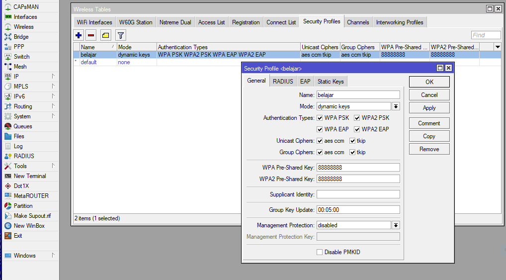
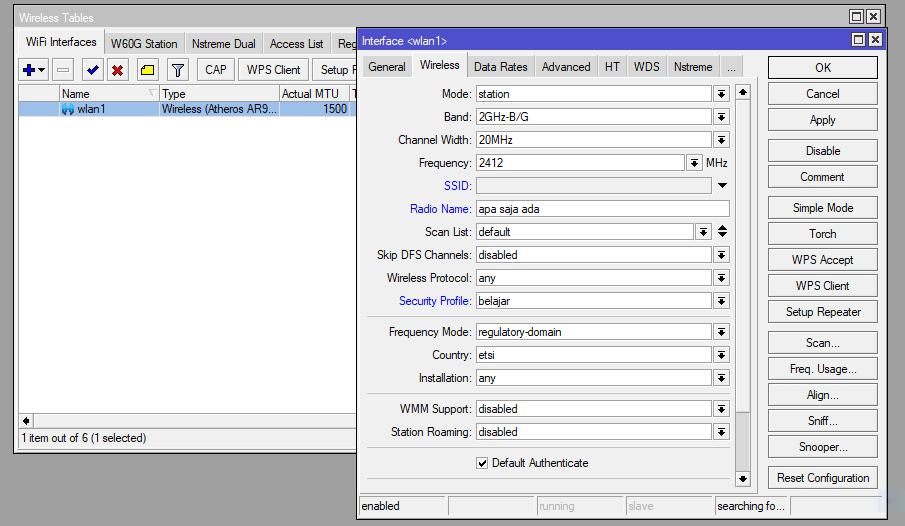
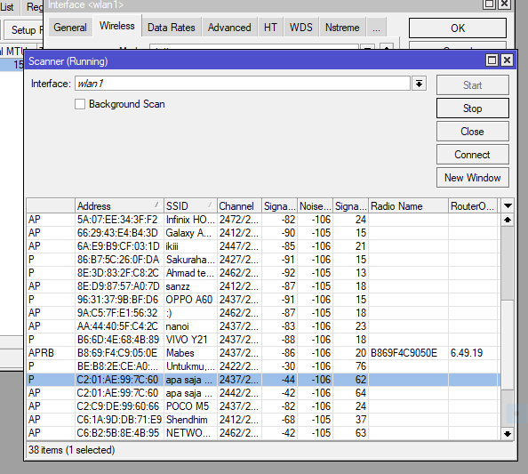
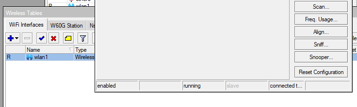
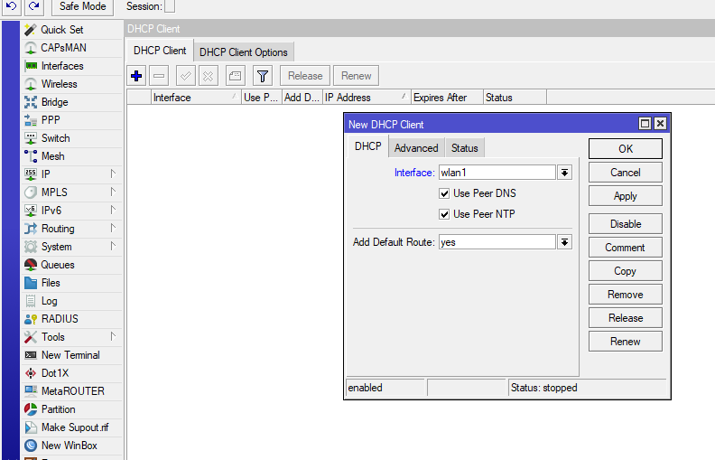
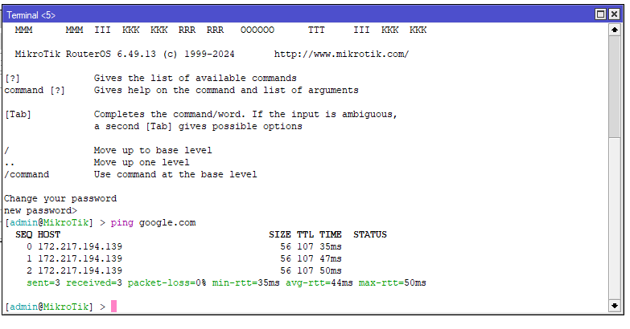
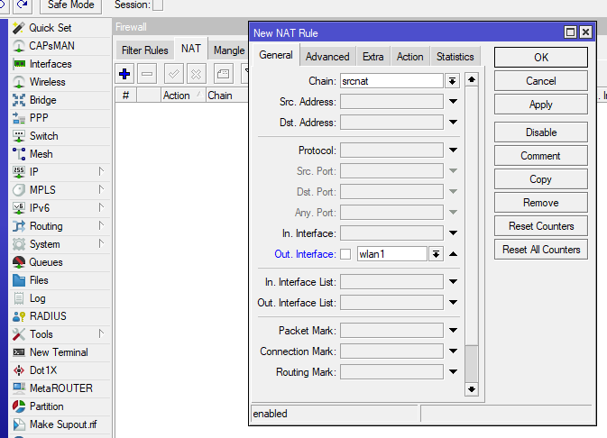
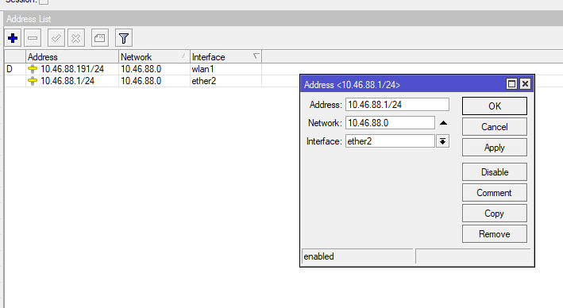
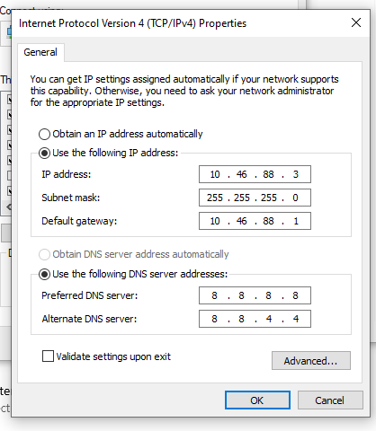
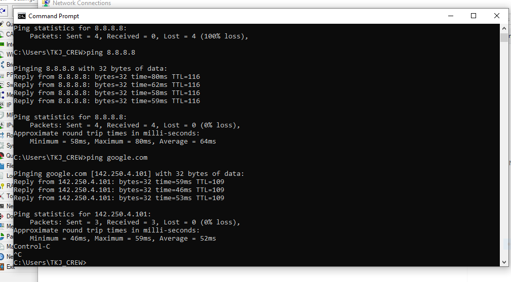

# LAB-6
tangal 13 agustus 2025
# Mengkoneksikan Mikrotik sebagai stasion ke Access Point

Mengkoneksikan Mikrotik sebagai station ke access Point ke Access Point :  

         1. Koneksi Mikrotik ke AP  
          - Konfigurasi Security Wireless  
            Wireless>Security Profiles  
            klik ( + ) General  
            Ceklis semua Authentication Types, Unicast Chipers, Group Chipers,
            untuk nama bebas
            mode : dynamic keys
            WPA Pre-Shared Key : (pin wifi sndiri)  
            WPA2 Pre-Shared Key : (pin wifi sndiri)  
            klik Apply lalu OK  
            

         - Konfigurasi interface wlan1
           pilih Wireless>Interfaces>wlan1
           klik Tab Wireless>Advanced Mode
           pilih mode: station
           isi Radio Name:/nama hospot
           Security Profile: /nama 
           

           klik Scan>Start
           Klik (nama hospot) lalu Connect
           Apply trus ok
           

         - DHCP Client untuk wlan1
           buka IP>DHCP Client
           klik +
           masukan Interface: wlan1
           trus Apply lalu OK

Test koneksi Mikrotik ke Internet dengan cara Ping di terminal:

      2. Mikrotik Sebagai Gateway
        - Konfigurasi NAT
          pilih IP>Firewall>NAT
          klik + 
            di tab general masukan:
          Chain: Srcnat
          Out.Interface: wlan1
           dan di tab Action masukan:
          Action: masquerade
          apply lalu ok

          
        - Konfigurasi IP ether2
          pilih IP>Address
          klik + 
          lalu masukan Address: 
          pilih Interface: ether2
          Apply lalu OK

     3. Konfigurasi IP Klien/Laptop
        buka  network & internet settings pilih change adapter options masukan: 
          IP address: 10.46.88.3
          Subnet mask: 255.255.255.0
          Default gateway: 10.46.88.1
          Use the following DNS server address:
          Prefered DNS server: 8.8.8.8
          Secondary DNS server: 8.8.4.4

   Test Koneksi Laptop ke Internet via cmd dengan cara ping google.com 

# kesimpulan   
Konfigurasi ini adalah konfigurasi yang cocok untuk access yang tidak punya kabel internet,   
yang dapat memudahkan. MikroTik akan bertindak sebagai klien, menerima koneksi dari access point 
dan menyediakan akses internet bagi perangkat lain yang terhubung ke MikroTik. 
